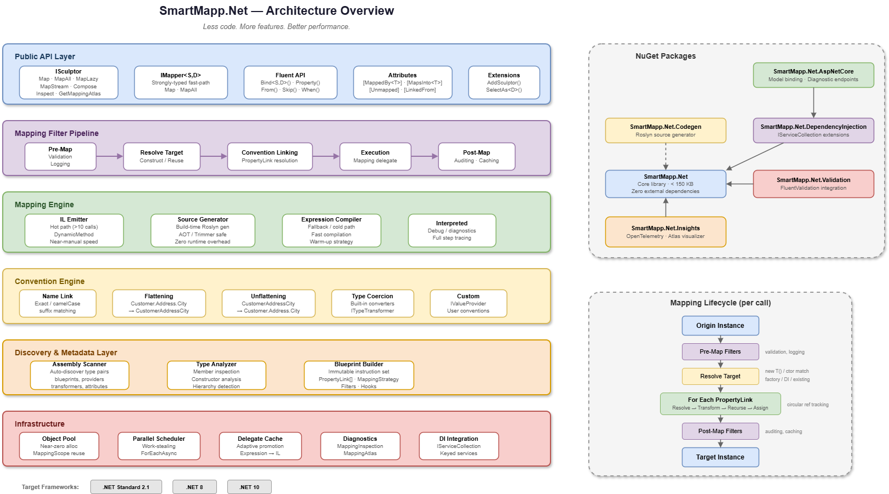

# SmartMapp.Net

[](https://github.com/user/smartmapp.net/actions/workflows/ci.yml)
[](LICENSE)

**High-performance, zero-configuration object-to-object mapping library for .NET.**

*Less code. More features. Better performance.*

---

## Overview

SmartMapp.Net transforms data between domain models, DTOs, view models, and API contracts with **zero configuration** for the vast majority of use cases. It scans assemblies at startup, automatically discovers type pairs, and links properties by name, type, and structural similarity.

When you need control, a fluent API, attribute-based configuration, or reusable blueprints let you override any convention — without touching the rest.

```csharp
// Register — auto-discovers all mappings in calling assembly
services.AddSculptor();

// Map
var dto = sculptor.Map<Order, OrderDto>(order);
```

That's it. No profiles, no explicit type registration, no per-property configuration.

---

## The Problem

Every .NET application that follows clean architecture must translate objects between layers (database entities → domain models → API responses → view models). Existing mapping libraries share common limitations:

- **Extensive ceremony** — explicit registration and per-property configuration for every type pair
- **Performance overhead** — reliance on reflection and expression tree compilation leads to unnecessary allocations
- **Limited modern .NET support** — most solutions lack AOT/trimming safety, `IAsyncEnumerable` support, and parallel collection processing
- **Opaque diagnostics** — debugging why a property received an unexpected value is difficult and time-consuming

SmartMapp.Net eliminates these pain points through **zero-config auto-discovery**, a **multi-tier performance engine**, **compile-time source generation**, and **enterprise-grade observability**.

---

## Key Capabilities

| Capability | Description |
|---|---|
| **Auto-Discovery** | Assembly scanning links types by name conventions, suffixes, structural similarity |
| **Fluent API** | `Bind<S,D>().Property(d => ..., p => p.From(...))` — concise and chainable |
| **Attribute-Based Config** | `[MappedBy<T>]`, `[Unmapped]`, `[LinkedFrom]` — zero boilerplate |
| **Polymorphic Mapping** | Automatic inheritance hierarchy detection — no manual configuration |
| **Deep Object Graphs** | Recursive nested mapping with circular reference tracking |
| **Collection Support** | All .NET collection types including immutable, observable, and read-only |
| **Flattening / Unflattening** | `Customer.Address.City` ↔ `CustomerAddressCity` — bidirectional, automatic |
| **Record & Init Support** | Full support for C# records, `init`-only properties, `required` members |
| **Parallel Processing** | Collections above a configurable threshold mapped in parallel automatically |
| **Streaming** | `IAsyncEnumerable` support for large dataset streaming (`MapStream`) |
| **Multi-Origin Composition** | Combine N source objects into a single target (`Compose`) |
| **IQueryable Projection** | `SelectAs<D>()` generates SQL-translatable expressions for EF Core |
| **Bidirectional Mapping** | Single `.Bidirectional()` call creates the inverse mapping |
| **Extensibility** | Addon system, mapping filters (middleware), hooks, custom conventions |
| **DI Integration** | Single `services.AddSculptor()` call; supports keyed services (.NET 8+) |
| **Validation** | FluentValidation integration; startup and runtime configuration checks |

---

## Performance Targets

| Scenario | Target |
|---|---|
| Flat 10-property DTO (warm) | < 100 ns |
| Nested 3-level object (warm) | < 500 ns |
| 1,000-item collection | < 100 μs |
| Memory per flat mapping | **0 bytes** (pooled) |
| Startup scan (100 types) | < 50 ms |

Performance is achieved through IL Emit code generation, adaptive hot-path promotion, SIMD-accelerated primitive copies, object pooling, and automatic parallel collection processing.

---

## Comparison vs AutoMapper

| Dimension | AutoMapper | SmartMapp.Net |
|---|---|---|
| **Setup** | Explicit profile registration per type pair | Zero-config auto-discovery; opt-in overrides |
| **Performance** | Reflection + expression trees | IL Emit + source gen + SIMD (roadmap) |
| **Memory** | Allocations on every call | Near-zero allocation (pooled) |
| **AOT / Trimming** | Generally unsupported | Fully supported via source gen |
| **Parallelism** | Manual or unsupported | Automatic parallel collections |
| **Diagnostics** | Basic configuration validation | Full telemetry, atlas visualizer, `Inspect<S,D>()` |
| **Streaming** | Generally unsupported | `IAsyncEnumerable` native (`MapStream`) |
| **Composition** | None out-of-the-box | `Compose<T>(params object[])` multi-origin |
| **Projection** | `ProjectTo<T>()` requires extension | `SelectAs<T>(sculptor)` on any `IQueryable` |
| **Modern C#** | Partial record/init support | Full record, `init`, `required` member support |
| **Extensibility** | Limited plugin models | Addon system, filter pipeline, hooks, events |


## Quick Start

```shell
dotnet add package SmartMapp.Net
dotnet add package SmartMapp.Net.DependencyInjection
```

```csharp
var builder = WebApplication.CreateBuilder(args);
builder.Services.AddSculptor();                      // zero-config auto-discovery

var app = builder.Build();
app.MapGet("/orders/{id}", async (int id, ISculptor sculptor, AppDbContext db) =>
{
    var order = await db.Orders.Include(o => o.Customer).Include(o => o.Lines)
        .FirstOrDefaultAsync(o => o.Id == id);
    return order is null ? Results.NotFound() : Results.Ok(sculptor.Map<Order, OrderDto>(order));
});
app.Run();
```

### Customize (optional)

```csharp
// Fluent API — override only what auto-discovery can't infer
services.AddSculptor(options =>
{
    options.Bind<Order, OrderDto>(rule => rule
        .Property(d => d.CustomerFullName,
                  p => p.From(s => $"{s.Customer.FirstName} {s.Customer.LastName}"))
        .Property(d => d.InternalCode, p => p.Skip()));
});
```

```csharp
// Attribute-based — decorate your DTOs
[MappedBy<Order>]
public record OrderDto
{
    public int Id { get; init; }
    public string CustomerFullName { get; init; }

    [Unmapped]
    public string InternalCode { get; init; }
}
```

```csharp
// Blueprint-based — reusable configuration classes
public class OrderBlueprint : MappingBlueprint
{
    public override void Design(IBlueprintBuilder plan)
    {
        plan.Bind<Order, OrderDto>()
            .Property(d => d.Total,
                      p => p.From(s => s.Lines.Sum(l => l.Quantity * l.UnitPrice)))
            .OnMapped((origin, target) => target.MappedAt = DateTime.UtcNow);
    }
}
```


## Architecture




## Samples

| Sample | Description |
|---|---|
| [`samples/SmartMapp.Net.Samples.Console`](samples/SmartMapp.Net.Samples.Console) | Runnable console walkthrough covering zero-config flat mapping, flattening, collections, polymorphism, inline `Bind<S,D>`, blueprint classes, `[MappedBy<T>]` / `[Unmapped]` attributes, the `MapTo<T>()` extension, and bidirectional mapping. Run with `dotnet run --project samples/SmartMapp.Net.Samples.Console`. |
| [`samples/SmartMapp.Net.Samples.MinimalApi`](samples/SmartMapp.Net.Samples.MinimalApi) | Production-shaped ASP.NET Minimal API + EF Core InMemory: DI registration, `SelectAs<OrderListDto>(sculptor)` server-side projection on `/orders`, `ISculptor.Map<Order, OrderDto>` with a DI-resolved `TaxCalculatorProvider` on `/orders/{id}`, and a `Testing` launch profile that demonstrates `SculptorStartupValidator` fail-fast. Run with `dotnet run --project samples/SmartMapp.Net.Samples.MinimalApi`. |


## Packages

| Package | Description |
|---|---|
| [`SmartMapp.Net`](https://www.nuget.org/packages/SmartMapp.Net) | Core library — mapping engine, conventions, fluent API. Zero external dependencies, < 150 KB. |
| [`SmartMapp.Net.Codegen`](https://www.nuget.org/packages/SmartMapp.Net.Codegen) | Roslyn source generator for compile-time mapping code emission (AOT safe) |
| [`SmartMapp.Net.DependencyInjection`](https://www.nuget.org/packages/SmartMapp.Net.DependencyInjection) | `IServiceCollection` extensions for DI registration |
| [`SmartMapp.Net.AspNetCore`](https://www.nuget.org/packages/SmartMapp.Net.AspNetCore) | Model binding, request/response filters, diagnostic endpoints |
| [`SmartMapp.Net.Insights`](https://www.nuget.org/packages/SmartMapp.Net.Insights) | OpenTelemetry instrumentation, mapping atlas visualizer, health checks |
| [`SmartMapp.Net.Validation`](https://www.nuget.org/packages/SmartMapp.Net.Validation) | FluentValidation integration for pre/post-map validation |


## Supported Frameworks

| Framework | Support Level |
|---|---|
| .NET 10 | Full (all features) |
| .NET 8 | Full (all features including FrozenDictionary, keyed services) |
| .NET Standard 2.1 | Core features (no codegen, no SIMD, no keyed services) |


## Core Concepts

| Concept | Description |
|---|---|
| **Sculptor** | The runtime engine — primary interface (`ISculptor`) for all mapping operations |
| **Blueprint** | An immutable instruction set describing how every member of a target type is populated |
| **Property Link** | A single origin → target member instruction within a Blueprint |
| **Convention** | An auto-linking rule (exact name, flattening, case conversion, abbreviation, etc.) |
| **Forge** | The act of freezing configuration into an immutable, thread-safe Sculptor |
| **Mapping** | The act of transforming one object into another |

```csharp
// Build manually without DI
var sculptor = new SculptorBuilder()
    .ScanAssembliesContaining<Order>()
    .UseBlueprint<OrderBlueprint>()
    .Forge();

var dto = sculptor.Map<Order, OrderDto>(order);
```

## Advanced Usage

### Collection Mapping

```csharp
// Batch
IReadOnlyList<OrderDto> dtos = sculptor.MapAll<Order, OrderDto>(orders);

// Lazy (deferred)
IEnumerable<OrderDto> lazy = sculptor.MapLazy<Order, OrderDto>(orders);

// Streaming (IAsyncEnumerable)
await foreach (var dto in sculptor.MapStream<Order, OrderDto>(ordersAsync))
{
    await ProcessAsync(dto);
}
```

### IQueryable Projection

```csharp
// Translates to SQL — only selected columns are fetched
var dtos = await dbContext.Orders
    .SelectAs<OrderDto>(sculptor)
    .Where(d => d.Total > 100)
    .ToListAsync();
```

### Multi-Origin Composition

```csharp
var viewModel = sculptor.Compose<DashboardViewModel>(user, orderSummary, notifications);
```

### Diagnostics

```csharp
// Inspect any mapping decision
var inspection = sculptor.Inspect<Order, OrderDto>();
Console.WriteLine(inspection.ToString());
// Order -> OrderDto (Strategy: ILEmit, 8 links)
//   Id -> Id (ExactNameLink)
//   Customer.FirstName + Customer.LastName -> CustomerFullName (CustomProvider)
//   InternalCode -> [SKIPPED]
//   ...
```


## Implementation Roadmap

| Phase | Version | Focus |
|---|---|---|
| **Core** | v1.0 | Foundation types, convention engine, mapping engine, collections, fluent API, DI integration |
| **Performance** | v1.1 | IL Emit engine, object pooling, parallel collections, SIMD optimizations |
| **Advanced** | v1.2 | Source generator, filter pipeline, streaming, composition, addon system |
| **Ecosystem** | v1.3 | ASP.NET Core integration, OpenTelemetry, FluentValidation |
| **Intelligence** | v2.0 | Dynamic mapping, Roslyn analyzers, expression visitors |


## Building from Source

### Prerequisites

- [.NET 10 SDK](https://dotnet.microsoft.com/download) (builds all target frameworks)

### Build

```shell
git clone https://github.com/user/smartmapp.net.git
cd smartmapp.net
dotnet restore
dotnet build
```

### Test

```shell
dotnet test
```

### Pack

```shell
dotnet pack src/SmartMapp.Net/SmartMapp.Net.csproj --configuration Release --output ./artifacts
```

### Benchmarks

```shell
dotnet run --project benchmarks/SmartMapp.Net.Benchmarks --configuration Release
```


## License

This project is licensed under the [MIT License](LICENSE).


## Contributing

Contributions are welcome! Start by reading [`docs/requirements/spec.md`](docs/requirements/spec.md)
for the authoritative library contract and [`docs/requirements/implementation-plan.md`](docs/requirements/implementation-plan.md)
for the sprint-by-sprint roadmap. Current sprint task pads live under
`docs/requirements/sprint-*.md`.

Before opening a pull request:

1. `dotnet restore && dotnet build -warnaserror`
2. `dotnet test` — the Sprint 8 test suite runs in under 10 seconds locally.
3. Run the samples — `dotnet run --project samples/SmartMapp.Net.Samples.Console` and
   `dotnet run --project samples/SmartMapp.Net.Samples.MinimalApi` should both succeed.
4. Add an entry to [`CHANGELOG.md`](CHANGELOG.md) under the `[Unreleased]` section.

New features should ship with tests and spec references; bug fixes should include a
regression test and reference the relevant `§` in the spec.


## Acknowledgements

SmartMapp.Net is built with:

- [xUnit](https://xunit.net/) — testing framework
- [FluentAssertions](https://fluentassertions.com/) — assertion library
- [NSubstitute](https://nsubstitute.github.io/) — mocking library
- [BenchmarkDotNet](https://benchmarkdotnet.org/) — performance benchmarking


## Why SmartMapp.Net?

1. **Developer Productivity** — Eliminates 80–95% of mapping boilerplate. Teams spend time on business logic, not plumbing.
2. **Runtime Performance** — Near-manual-code speed with zero allocations on hot paths. Measurable reduction in API latency and cloud compute costs.
3. **Cloud-Native Ready** — AOT and trimmer safe via source generation. Critical for serverless, container, and mobile targets where startup time and binary size matter.
4. **Operational Visibility** — Built-in OpenTelemetry, diagnostic endpoints, and mapping inspection. Production issues are diagnosed in minutes, not hours.
5. **Low Adoption Risk** — MIT licensed, zero dependencies in the core package, includes migration guides from popular libraries, and supports incremental adoption alongside existing solutions.

---

*SmartMapp.Net: Less code. More features. Better performance.*
